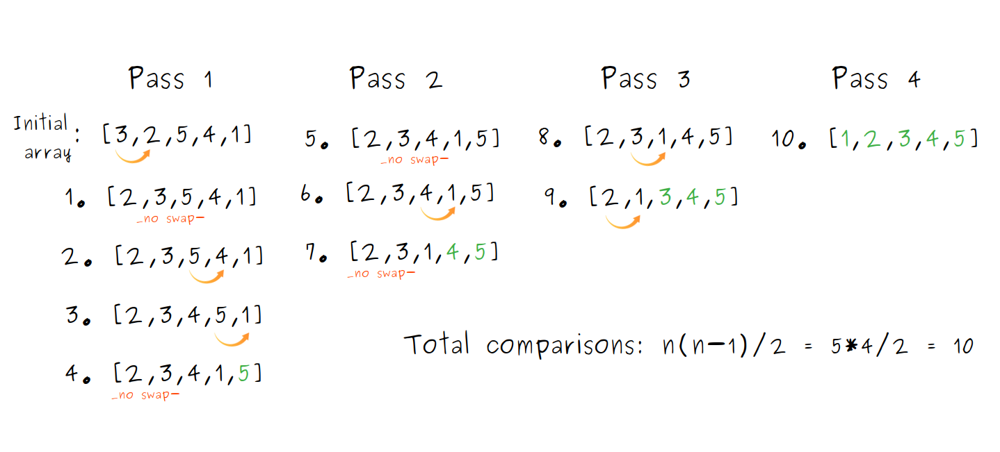

# Bubble Sort in TypeScript
Bubble sort works by repeatedly comparing and swapping adjacent elements in pairs until the array is sorted.

It is called bubble sort because the largest numbers "bubble up" to the end of the array, one by one.

## How Bubble Sort Works
- Start a **pass** over the array.
   - Compare the first pair.
   - Swap them if the first one is bigger.
   - Move to the next pair and continue to the end of the array.
- The last unsorted element is guaranteed to be in the correct place.
- Repeat passes until no swaps are needed.

## Bubble Sort Pseudocode
```
BUBBLE SORT(A)
 for i = 1 to A.length - 1
     for j = A.length downto i + 1
         if A[j] < A[j-1]
             exchange A[j] with A[j-1]
```
## Bubble Sort Visualization


## Complexity Analysis
Bubble Sort performance depends on the input order, so for an array of length **n**:

### Worst Case
For a reversed array like [5, 4, 3, 2, 1], bubble sort performs a swap on every comparison.

- Total comparisons: `1 + 2 + 3 + ... + (n-1) = n(n-1)/2`
- Time Complexity: **O(n²)**

### Best Case
For an already sorted array like [1, 2, 3, 4, 5], bubble sort completes in a single pass with no swaps needed.

- Total comparisons: `n - 1` 
- Time Complexity: **O(n)**

### Space Complexity
Bubble Sort is an in-place algorithm, meaning it sorts elements directly within the same array and does not create extra arrays or lists. 

The only additional memory used is a few variables, such as loop counters and a temporary swap variable.

- Space complexity: **O(1)** (constant memory)

### Complexity Summary
In the worst case, bubble sort makes exactly (n² - n)/2,
which simplifies to **O(n²) time complexity** when dropping constants and lower-order terms.

It also has **O(1) space complexity**, since it is in-place and only uses a few extra variables.

## Bubble Sort Implementations in TypeScript

### Implementation 1: Using for-loops
```ts
function bubbleSort(array: number[]): number[] {
  // Keep the classic `n` to represent the array size, useful for discussing time complexity.
  const n = array.length;

  for (let pass = 0; pass < n - 1; pass++) {
    // 'n - pass - 1' ensures we skip the elements already in their correct positionse
    for (let index = 0; index < n - pass - 1; index++) {
            if (array[index] > array[index + 1]) {
                [array[index], array[index + 1]] = [array[index + 1], array[index]];
            }
        }
    }
    return array;
}
```

### Implementation 2: Using a while-loop
```ts
function bubbleSort(array: number[]): number[] {
  // Keep the classic `n` to represent the array size, useful for discussing time complexity.
  let n = array.length;
  let swapped: boolean;

  do {
    swapped = false;
    for (let index = 0; index < n - 1; index++) {
      if (array[index] > array[index + 1]) {
        [array[index], array[index + 1]] = [array[index + 1], array[index]];
        swapped = true;
      }
    }
    n--; // Reduce the length for the next pass; the last element is already in its correct place.
  } while (swapped);
  return array;
}
```